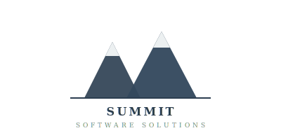

<p align="center">
  
  <br/>
  <strong>Summit Software Solutions LLC</strong>
  <br/>
  <em>Every Solution. One Partner.</em>
</p>

<h1 align="center">Summit Claude Skills</h1>

<p align="center">
  The definitive curated directory of the top 50 open-source Claude skills, MCP servers, system prompts, and prompt libraries — scored, reviewed, and organized for instant use.
</p>

<p align="center">
  <a href="#quick-start-by-role">Quick Start</a> •
  <a href="#the-top-50">Browse All 50</a> •
  <a href="#category-install-prompts">Copy-Paste Prompts</a> •
  <a href="#meta-collection-showdown">Compare Meta-Repos</a> •
  <a href="CONTRIBUTING.md">Contribute</a>
</p>

---

## What This Is

Every entry links to an open-source GitHub repository. We don't host or redistribute any code — we link to the original source and provide **one-line install prompts** you can paste directly into your Claude session.

**For Claude.ai users (non-technical):** Copy the prompt from any expandable "Install Prompt" section and paste it into Claude.ai chat. Claude will fetch the skill and apply it to your session.

**For Claude Code / terminal users:** Use the `npx` or `git clone` command in the "CLI Install" column.

> **Security note:** Skills can execute code in Claude's environment. Only install from trusted sources. Always review a skill's SKILL.md before use.

---

## Quick Start by Role

| I am a... | Start with these categories |
|---|---|
| **Software Engineer** | [Development Core](#1-development-core), [Testing & QA](#2-testing--qa), [DevOps & Infrastructure](#5-devops--infrastructure) |
| **Security Engineer** | [Security & Compliance](#3-security--compliance), [Testing & QA](#2-testing--qa) |
| **Designer / Frontend Dev** | [Frontend & Design](#4-frontend--design), [Document & Content Creation](#6-document--content-creation) |
| **Startup Founder** | [Product & Strategy](#8-product--strategy), [Marketing & Growth](#9-marketing--growth), [Business Operations](#10-business-operations) |
| **Researcher / Writer** | [Research & Knowledge](#11-research--knowledge-management), [Prompt Engineering](#12-system-prompts--prompt-engineering) |
| **Ops / DevOps** | [DevOps & Infrastructure](#5-devops--infrastructure), [MCP Servers](#7-mcp-servers--integrations) |
| **Power User (wants everything)** | [Meta-Collections](#13-meta-collections--frameworks), [Meta-Collection Showdown](#meta-collection-showdown) |

---

## Scoring Methodology

Each repo is scored on a **5-point composite scale**:

| Signal | Weight | Source |
|---|---|---|
| GitHub Stars | 30% | GitHub API (auto-updated weekly) |
| Fork Count & Contributors | 20% | GitHub API |
| Recency (last commit < 30 days) | 20% | GitHub API |
| Documentation Quality | 15% | Manual review of SKILL.md / README |
| Community References | 15% | Citations in awesome-lists, blog posts, articles |

**Ratings:** **S** = Best-in-class (4.5-5.0) | **A** = Excellent (3.5-4.4) | **B** = Strong (2.5-3.4)

   

---

## The Top 50

### 1. Development Core

Skills for writing, reviewing, debugging, and shipping code.

| # | Repository | Stars | Rating | What It Does | CLI Install |
|---|---|---|---|---|---|
| 1 | [obra/superpowers](https://github.com/obra/superpowers) | 12k+ | **S** | Full dev methodology — brainstorming, TDD, subagent-driven development, git worktrees, code review | `/plugin marketplace add obra/superpowers` |
| 2 | [obra/superpowers-skills](https://github.com/obra/superpowers-skills) | 2k+ | **A** | Community-editable extension skills for the Superpowers plugin | Auto-installed with superpowers |
| 3 | [obra/superpowers-lab](https://github.com/obra/superpowers-lab) | 1.5k+ | **A** | Experimental skills — semantic duplicate detection, on-demand MCP, Windows VM management | `claude-code plugin install https://github.com/obra/superpowers-lab` |
| 4 | [alirezarezvani/claude-skills](https://github.com/alirezarezvani/claude-skills) | 8k+ | **S** | 192+ skills with 268 Python CLI tools (zero deps). Works across 11 platforms | `git clone https://github.com/alirezarezvani/claude-skills.git` |
| 5 | [davila7/claude-code-templates](https://github.com/davila7/claude-code-templates) | 21k+ | **S** | Massive template collection. Starter configs, CLAUDE.md patterns, workflow templates | `git clone https://github.com/davila7/claude-code-templates.git` |

#### Mini-Reviews

**obra/superpowers** — Rating: **S**
The gold standard skill framework, created by Jesse Vincent. Implements a complete software development methodology: brainstorming forces Claude to refine your idea before writing code, TDD enforces red-green-refactor, and subagent-driven development launches autonomous workers that can run for hours. The `/brainstorm` → `/write-plan` → `/execute-plan` workflow is transformative for complex features.
- **Pros:** Autonomous multi-hour dev sessions, excellent TDD enforcement, git worktree isolation, active community, plugin marketplace install
- **Cons:** Opinionated workflow may clash with your process, learning curve for subagent delegation, requires Claude Code (not Claude.ai)

**alirezarezvani/claude-skills** — Rating: **S**
The broadest single-repo collection. 192+ SKILL.md files organized by domain (engineering, marketing, product, compliance, C-level advisory) plus 268 Python CLI scripts that need zero pip installs. Cross-platform via `./scripts/convert.sh` — same skills on Claude Code, Codex, Gemini CLI, Cursor, and 7 more.
- **Pros:** Zero-dep Python tools, cross-platform conversion, semantic versioning, coverage from engineering to regulatory compliance
- **Cons:** Quantity over depth in some domains — marketing and compliance skills thinner than engineering, individual skill docs vary

**davila7/claude-code-templates** — Rating: **S**
At 21k+ stars, the most-starred Claude Code repo. Project starter kits and CLAUDE.md patterns rather than reusable workflows — use at project init, not during daily development.
- **Pros:** Massive community validation, excellent scaffolding, well-organized by project type
- **Cons:** Templates (project init), not active skills (daily use)

<details>
<summary><strong>Install Prompt — Development Core (paste into Claude.ai)</strong></summary>

```
I want to set up development skills for Claude Code. Please fetch and review the SKILL.md files from these repositories, then create a consolidated development workflow I can use:

1. https://github.com/obra/superpowers — brainstorming, TDD, subagent-driven development, code review methodology
2. https://github.com/alirezarezvani/claude-skills — engineering domain skills (192+ skills)
3. https://github.com/davila7/claude-code-templates — project templates and CLAUDE.md patterns

For each, summarize: key workflows, slash commands, activation triggers, and when to use each. Then create a unified CLAUDE.md section I can paste into any project that references the best practices from all three.
```
</details>

---

### 2. Testing & QA

| # | Repository | Stars | Rating | What It Does | CLI Install |
|---|---|---|---|---|---|
| 6 | [obra TDD skill](https://github.com/obra/superpowers) | (in superpowers) | **S** | Red-green-refactor TDD. Tests before implementation. Enforces YAGNI and DRY | Included in superpowers |
| 7 | [obra systematic-debugging](https://github.com/obra/superpowers) | (in superpowers) | **S** | Methodical bug investigation. Use before proposing any fix | Included in superpowers |
| 8 | [obra root-cause-tracing](https://github.com/obra/superpowers) | (in superpowers) | **A** | Traces errors back to original trigger deep in execution chains | Included in superpowers |
| 9 | [webapp-testing skill](https://github.com/BehiSecc/awesome-claude-skills) | 500+ | **A** | Playwright-based toolkit for testing local web applications | `cp -r webapp-testing ~/.claude/skills/` |

#### Mini-Reviews

**obra TDD skill** — Rating: **S**
Not a generic "write tests first" instruction — a complete methodology. Claude writes a failing test, runs it (red), writes minimum code to pass (green), then refactors. YAGNI enforcement is aggressive: Claude pushes back on speculative features. With subagents, you get autonomous TDD loops.
- **Pros:** Real red-green-refactor (not lip service), autonomous TDD loops via subagents, YAGNI/DRY enforcement
- **Cons:** Requires full superpowers plugin, can be overkill for simple changes

**webapp-testing skill** — Rating: **A**
Playwright under the hood — Claude clicks buttons, fills forms, takes screenshots, and asserts on DOM state in running web apps.
- **Pros:** Real browser interaction, screenshot capture, works with any local web app
- **Cons:** Requires Playwright install, slower than unit tests

<details>
<summary><strong>Install Prompt — Testing & QA (paste into Claude.ai)</strong></summary>

```
I want to adopt test-driven development with Claude. Please fetch the TDD, debugging, and testing skills from https://github.com/obra/superpowers and the webapp-testing skill, then create:

1. A red-green-refactor TDD checklist with specific Claude prompts for each phase
2. Systematic debugging methodology when tests fail
3. Root-cause tracing procedure for deep execution chain errors
4. E2E testing workflow using Playwright for web applications
5. Testing anti-patterns to avoid

Format as a practical reference card.
```
</details>

---

### 3. Security & Compliance

| # | Repository | Stars | Rating | What It Does | CLI Install |
|---|---|---|---|---|---|
| 10 | [Trail of Bits security skills](https://github.com/trailofbits) | 3k+ | **S** | CodeQL/Semgrep static analysis, variant analysis, code auditing, fix verification | See repo for install |
| 11 | [zebbern/claude-code-guide](https://github.com/zebbern/claude-code-guide) | 2k+ | **A** | Comprehensive security suite. Source for ~60 security-focused skills | `git clone https://github.com/zebbern/claude-code-guide.git` |
| 12 | [owasp-security skill](https://github.com/BehiSecc/awesome-claude-skills) | 1k+ | **A** | OWASP Top 10:2025, ASVS 5.0, Agentic AI security (2026). Checklists for 20+ languages | `cp -r owasp-security ~/.claude/skills/` |
| 13 | [varlock-claude-skill](https://github.com/BehiSecc/awesome-claude-skills) | 500+ | **B** | Secure env var management. Secrets never in sessions, terminals, logs, or git | `cp -r varlock-claude-skill ~/.claude/skills/` |
| 14 | [sanitize skill](https://github.com/BehiSecc/awesome-claude-skills) | 400+ | **B** | PII detection/redaction — 15 categories. Zero deps, local processing | `cp -r sanitize ~/.claude/skills/` |

#### Mini-Reviews

**Trail of Bits security skills** — Rating: **S**
From one of the most respected security firms. Real CodeQL/Semgrep workflows — production patterns from professional audits. Variant analysis is the standout: find one vuln, then search for the entire family across your codebase.
- **Pros:** Professional firm backing, real static analysis, variant analysis finds vuln families, fix verification
- **Cons:** Requires CodeQL/Semgrep installed, steep learning curve, time-consuming on large codebases

**owasp-security skill** — Rating: **A**
OWASP Top 10:2025 as code review checklists with language-specific quirks for 20+ languages. Also covers ASVS 5.0 and Agentic AI security (2026).
- **Pros:** Current OWASP Top 10, ASVS 5.0, 20+ language checklists, Agentic AI security category
- **Cons:** Compliance-focused, not exploit-focused

**varlock-claude-skill** — Rating: **B**
Simple but critical: prevents secrets from leaking into Claude sessions, terminal output, logs, or git commits.
- **Pros:** Zero-overhead, prevents the most common AI credential leak vector
- **Cons:** Narrow scope — does one thing

**sanitize skill** — Rating: **B**
Detects and redacts PII across 15 categories (SSNs, credit cards, API keys, emails, phones). Fully local.
- **Pros:** 15 PII categories, zero deps, fully local
- **Cons:** Pattern-based — false positives on edge cases

<details>
<summary><strong>Install Prompt — Security & Compliance (paste into Claude.ai)</strong></summary>

```
I want Claude to perform professional security reviews. Please fetch and synthesize:

1. Trail of Bits security skills — CodeQL/Semgrep static analysis, variant analysis, fix verification
2. OWASP security skill — Top 10:2025, ASVS 5.0, code review checklists for 20+ languages
3. varlock skill — secret management and leak prevention
4. sanitize skill — PII detection and redaction (15 categories)

Create a "Security Review Playbook" with:
1. Pre-commit security checklist (10 items)
2. Static analysis workflow with specific CodeQL and Semgrep commands
3. OWASP compliance verification matrix
4. Secret scanning and PII redaction steps
5. Fix verification procedure to confirm patches work
```
</details>

---

### 4. Frontend & Design

| # | Repository | Stars | Rating | What It Does | CLI Install |
|---|---|---|---|---|---|
| 15 | [anthropics/skills (frontend-design)](https://github.com/anthropics/skills) | Official | **S** | 277k+ installs. Breaks "AI slop" aesthetics with bold design philosophy | `npx skills add anthropics/claude-code --skill frontend-design` |
| 16 | [ChrisWiles/claude-code-showcase](https://github.com/ChrisWiles/claude-code-showcase) | 1k+ | **A** | React UI patterns and Design Systems. Production-grade components | `git clone https://github.com/ChrisWiles/claude-code-showcase.git` |
| 17 | [steipete/oracle](https://github.com/steipete/oracle) | 1.6k+ | **A** | Design auditor — 17 rules, 100-point scoring (typography, WCAG, spacing, iconography) | See repo for install |
| 18 | [anthropics/skills (canvas-design)](https://github.com/anthropics/skills) | Official | **A** | Visual art as PNG/PDF. Posters, artwork, static visuals | `npx skills add anthropics/claude-code --skill canvas-design` |
| 19 | [anthropics/skills (algorithmic-art)](https://github.com/anthropics/skills) | Official | **A** | p5.js generative art, seeded randomness, interactive parameters | `npx skills add anthropics/claude-code --skill algorithmic-art` |

#### Mini-Reviews

**Anthropic frontend-design** — Rating: **S**
The most-installed Claude skill (277k+). Attacks "distributional convergence" by forcing Claude to commit to a bold aesthetic before coding. Anti-patterns enforced: no Inter font, no purple gradients, no cookie-cutter layouts.
- **Pros:** Transforms generic AI output, anti-pattern enforcement, works across HTML/CSS/React/Vue, official quality
- **Cons:** May clash with existing brand guidelines, better for greenfield than iteration

**steipete/oracle** — Rating: **A**
Quantitative design auditor: 17 rules, 100-point score. Typography, WCAG accessibility, spacing, iconography, navigation, tokens. English + Korean.
- **Pros:** Quantitative scoring, WCAG built in, 17 rules, bilingual
- **Cons:** Rigid for intentionally rule-breaking designs

<details>
<summary><strong>Install Prompt — Frontend & Design (paste into Claude.ai)</strong></summary>

```
I want Claude to build distinctive, professional frontends. Please fetch and synthesize:

1. The official Anthropic frontend-design skill (277k+ installs)
2. steipete/oracle — 17-rule design audit with 100-point scoring
3. Anthropic canvas-design and algorithmic-art skills

Create a "Design Quality System" covering:
1. Pre-build design direction checklist (typography, color, motion, layout)
2. 17-rule audit scorecard
3. Anti-patterns to reject (generic AI aesthetics)
4. Templates for requesting and evaluating design reviews
```
</details>

---

### 5. DevOps & Infrastructure

| # | Repository | Stars | Rating | What It Does | CLI Install |
|---|---|---|---|---|---|
| 20 | [anthropics/skills (aws-skills)](https://github.com/anthropics/skills) | Official | **A** | AWS CDK, cost optimization, serverless architecture | `npx skills add anthropics/claude-code --skill aws-skills` |
| 21 | [hashicorp/agent-skills](https://github.com/hashicorp/agent-skills) | 2k+ | **A** | HashiCorp-maintained Terraform workflows. Official | `git clone https://github.com/hashicorp/agent-skills.git` |
| 22 | [diet103/claude-code-infrastructure-showcase](https://github.com/diet103/claude-code-infrastructure-showcase) | 800+ | **B** | Infrastructure and deployment guidelines. Production patterns | `git clone https://github.com/diet103/claude-code-infrastructure-showcase.git` |
| 23 | [changelog-generator skill](https://github.com/anthropics/skills) | Official | **B** | Auto-generates changelogs from git commits. Customer-friendly release notes | Built-in skill |

#### Mini-Reviews

**hashicorp/agent-skills** — Rating: **A**
Maintained by HashiCorp. Terraform plan/apply with safety checks — Claude won't apply changes without confirmation. Module development, state management, drift detection.
- **Pros:** Official HashiCorp, safety guardrails on destructive ops, well-tested patterns
- **Cons:** Terraform-specific only

**anthropics/aws-skills** — Rating: **A**
CDK patterns, cost optimization via MCP servers, serverless architecture. Claude flags expensive resource choices.
- **Pros:** Official quality, cost awareness, CDK best practices
- **Cons:** AWS-only

<details>
<summary><strong>Install Prompt — DevOps & Infrastructure (paste into Claude.ai)</strong></summary>

```
I need infrastructure automation skills. Please fetch:

1. https://github.com/hashicorp/agent-skills — Terraform workflows with safety checks
2. Anthropic aws-skills — CDK, cost optimization, serverless patterns
3. https://github.com/diet103/claude-code-infrastructure-showcase — deployment guidelines

Create runbooks for:
1. Terraform plan/apply with safety guardrails
2. AWS CDK deployment with cost optimization
3. CI/CD pipeline templates
4. Changelog generation from git history
```
</details>

---

### 6. Document & Content Creation

| # | Repository | Stars | Rating | What It Does | CLI Install |
|---|---|---|---|---|---|
| 24 | [anthropics/skills (docx)](https://github.com/anthropics/skills) | Official | **S** | Word docs with tracked changes, comments, formatting, TOCs, letterheads | Built-in to Claude.ai |
| 25 | [anthropics/skills (pptx)](https://github.com/anthropics/skills) | Official | **S** | Slide decks, layouts, templates, speaker notes | Built-in to Claude.ai |
| 26 | [anthropics/skills (xlsx)](https://github.com/anthropics/skills) | Official | **A** | Spreadsheets: formulas, charts, data transformations | Built-in to Claude.ai |
| 27 | [anthropics/skills (pdf)](https://github.com/anthropics/skills) | Official | **A** | Extract text, merge/split, watermark, fill forms, encrypt/decrypt | Built-in to Claude.ai |
| 28 | [email-html-mjml skill](https://github.com/BehiSecc/awesome-claude-skills) | 600+ | **A** | Responsive HTML emails via MJML 4.x. Cross-client validation | `cp -r email-html-mjml ~/.claude/skills/` |

#### Mini-Reviews

**Anthropic docx/pptx** — Rating: **S**
The reason many people upgrade to Pro. Docx handles tracked changes, comments, TOCs, page numbers, letterheads. Pptx generates real slide decks with layouts, not text dumps. Both produce professional output.
- **Pros:** Production-quality, complex formatting, built-in (no install)
- **Cons:** Pro/Max/Team/Enterprise only

**email-html-mjml skill** — Rating: **A**
Solves cross-client email rendering using MJML 4.x. Built-in validation, width math, component architecture.
- **Pros:** Cross-client rendering solved, validation, reusable components
- **Cons:** Requires MJML familiarity to customize

<details>
<summary><strong>Install Prompt — Document Creation (paste into Claude.ai)</strong></summary>

```
I need to master document creation. Review the Anthropic skills for docx, pptx, xlsx, pdf, plus the MJML email skill, then create:

1. Decision matrix: which format for which use case
2. Formatting cheat sheet per format
3. Three example prompts per format for best results
4. MJML email workflow for cross-client compatible emails
```
</details>

---

### 7. MCP Servers & Integrations

| # | Repository | Stars | Rating | What It Does | CLI Install |
|---|---|---|---|---|---|
| 29 | [modelcontextprotocol/servers](https://github.com/modelcontextprotocol/servers) | 40k+ | **S** | Official MCP repo. GitHub, PostgreSQL, Filesystem, SQLite, Slack, Drive, 100+ more | `npx -y @modelcontextprotocol/server-{name}` |
| 30 | [playwright MCP](https://github.com/microsoft/playwright-mcp) | 8k+ | **S** | Browser automation — screenshots, DOM, forms, testing | `npx -y @anthropic/mcp-server-playwright` |
| 31 | [memory MCP](https://github.com/modelcontextprotocol/servers) | (in official) | **A** | Knowledge-graph persistent memory across sessions | See official MCP repo |
| 32 | [Firecrawl MCP](https://github.com/mendableai/firecrawl) | 5k+ | **A** | URL-to-Markdown web scraping for RAG and LLM consumption | `npx -y firecrawl-mcp` |

#### Mini-Reviews

**modelcontextprotocol/servers** — Rating: **S**
At 40k+ stars, the foundation of the MCP ecosystem. 100+ production servers. One-line `npx` installs. Every Claude Code user should start here.
- **Pros:** Official Anthropic, 100+ servers, one-line install, production-tested
- **Cons:** Community servers vary in quality, 5-6 simultaneous servers is the practical limit

**Playwright MCP** — Rating: **S**
Real browser interaction — navigation, screenshots, DOM querying, form filling. Essential for testing and scraping.
- **Pros:** Real browser, screenshot capture, works with any web app, no API keys
- **Cons:** Heavyweight, slower than API approaches

<details>
<summary><strong>Install Prompt — MCP Servers (paste into Claude.ai)</strong></summary>

```
I want to set up MCP servers. Please review https://github.com/modelcontextprotocol/servers and create a setup guide for:

1. GitHub MCP — repo management, PR review, issue triage
2. PostgreSQL MCP — natural language database queries
3. Filesystem MCP — advanced file operations
4. Playwright MCP — browser automation
5. Memory MCP — persistent knowledge graph
6. Firecrawl MCP — web scraping

For each: install command, required env vars, 3 use cases, troubleshooting steps.
```
</details>

---

### 8. Product & Strategy

| # | Repository | Stars | Rating | What It Does | CLI Install |
|---|---|---|---|---|---|
| 33 | [wondelai/skills](https://github.com/wondelai/skills) | 1k+ | **A** | 25 skills: UX, CRO, sales, product strategy, growth (Norman, Cialdini, Ries, Hormozi) | `git clone https://github.com/wondelai/skills.git` |
| 34 | [alirezarezvani/claude-skills (product)](https://github.com/alirezarezvani/claude-skills) | (in 192+) | **A** | PRD generation, competitive analysis, feature prioritization, stakeholder comms | `/plugin install product-skills@claude-code-skills` |
| 35 | [OpenPaw](https://github.com/BehiSecc/awesome-claude-skills) | 800+ | **B** | 38-skill personal assistant — git, Telegram, Discord, Obsidian, daily briefing | See repo for install |

#### Mini-Reviews

**wondelai/skills** — Rating: **A**
Each of the 25 skills is grounded in a specific methodology from a recognized author. Not generic advice — structured frameworks with steps.
- **Pros:** Proven methodologies, UX through sales in one package, each skill references its source
- **Cons:** Gaps in analytics, data-driven product decisions, and technical PM

<details>
<summary><strong>Install Prompt — Product & Strategy (paste into Claude.ai)</strong></summary>

```
I need product strategy skills. Please fetch:

1. https://github.com/wondelai/skills — 25 skills (Norman, Cialdini, Ries, Hormozi)
2. Product skills from https://github.com/alirezarezvani/claude-skills

Create a "Product Manager's Toolkit" with:
1. PRD template (lean startup, Ries)
2. Feature prioritization (RICE, ICE, MoSCoW)
3. UX heuristic checklist (Norman)
4. Pricing framework (Hormozi)
5. Stakeholder persuasion templates (Cialdini)
```
</details>

---

### 9. Marketing & Growth

| # | Repository | Stars | Rating | What It Does | CLI Install |
|---|---|---|---|---|---|
| 36 | [clawfu/mcp-skills](https://github.com/clawfu/mcp-skills) | 1.5k+ | **A** | 169 marketing skills (Dunford, Schwartz, Ogilvy, Cialdini) as MCP with brand memory | See repo for MCP setup |
| 37 | [devmarketing-skills](https://github.com/BehiSecc/awesome-claude-skills) | 800+ | **A** | 33 dev marketing skills — HN, Reddit, SEO, newsletters, docs-as-marketing | `cp -r devmarketing-skills ~/.claude/skills/` |
| 38 | [ReScienceLab/opc-skills](https://github.com/ReScienceLab/opc-skills) | 445+ | **B** | Solopreneur SEO, geo, and LLM tools | `git clone https://github.com/ReScienceLab/opc-skills.git` |

#### Mini-Reviews

**clawfu/mcp-skills** — Rating: **A**
169 skills from Dunford (positioning), Schwartz (copywriting), Ogilvy (advertising), Cialdini (persuasion). MCP server with brand memory across sessions.
- **Pros:** Expert-sourced, brand memory persistence, 169 skills, MCP integration
- **Cons:** MCP setup required, brand memory needs configuration

**devmarketing-skills** — Rating: **A**
33 skills for developer marketing specifically: HN launches, technical tutorials, docs-as-marketing, Reddit, newsletters, devtools SEO.
- **Pros:** Developer-audience-specific, HN/Reddit strategy battle-tested, docs-as-marketing is unique
- **Cons:** Only useful if your market is developers

<details>
<summary><strong>Install Prompt — Marketing & Growth (paste into Claude.ai)</strong></summary>

```
I need marketing skills. Please fetch:

1. https://github.com/clawfu/mcp-skills — 169 marketing skills (Dunford, Schwartz, Ogilvy, Cialdini)
2. Developer marketing skills for HN, SEO, content
3. https://github.com/ReScienceLab/opc-skills — solopreneur tools

Create a "Growth Toolkit" with:
1. Positioning template (Dunford)
2. Landing page copy framework (Schwartz)
3. Email sequence templates (Cialdini)
4. Dev marketing playbook (HN, Reddit, docs-as-marketing)
5. SEO audit checklist
```
</details>

---

### 10. Business Operations

| # | Repository | Stars | Rating | What It Does | CLI Install |
|---|---|---|---|---|---|
| 39 | [csv-data-summarizer](https://github.com/BehiSecc/awesome-claude-skills) | 400+ | **B** | Auto-analyzes CSVs: columns, distributions, missing data, correlations | `cp -r csv-data-summarizer ~/.claude/skills/` |
| 40 | [postgres skill](https://github.com/BehiSecc/awesome-claude-skills) | 500+ | **B** | Safe read-only SQL against PostgreSQL. Multi-connection, defense-in-depth | `cp -r postgres ~/.claude/skills/` |
| 41 | [agent-cards-skill](https://github.com/BehiSecc/awesome-claude-skills) | 300+ | **B** | Prepaid virtual Visa cards for AI agents | See repo for setup |

#### Mini-Reviews

**csv-data-summarizer** — Rating: **B**
Drop a CSV, get instant profiling: column types, distributions, missing data %, correlations. Quick data exploration.
- **Pros:** Instant profiling, finds data quality issues, zero config
- **Cons:** CSV-only, basic stats

<details>
<summary><strong>Install Prompt — Business Operations (paste into Claude.ai)</strong></summary>

```
I need business operations skills. Please review the CSV summarizer, PostgreSQL skill, and MJML email skill, then create:

1. Data profiling quick-start (any CSV in 30 seconds)
2. Safe database querying with read-only protections
3. Business email templates (onboarding, invoicing, follow-ups)
4. Data quality checklist
```
</details>

---

### 11. Research & Knowledge Management

| # | Repository | Stars | Rating | What It Does | CLI Install |
|---|---|---|---|---|---|
| 42 | [glebis/claude-skills (doctorg)](https://github.com/glebis/claude-skills) | 1k+ | **A** | Evidence-based health research, GRADE ratings, Apple Health integration. Quick/deep/full tiers | `cp -r doctorg ~/.claude/skills/` |
| 43 | [glebis/claude-skills (notebooklm)](https://github.com/glebis/claude-skills) | 1k+ | **A** | Google NotebookLM — create, batch upload, research, podcast generation | `cp -r notebooklm ~/.claude/skills/` |
| 44 | [glebis/claude-skills (thinking-patterns)](https://github.com/glebis/claude-skills) | 1k+ | **B** | Cognitive pattern analysis across conversations. ~$3.50/run | `cp -r thinking-patterns ~/.claude/skills/` |

#### Mini-Reviews

**DoctorG** — Rating: **A**
Three-tier research: quick (30s), deep (90s), full (3min). GRADE-inspired evidence ratings on every claim. Apple Health integration for personalization.
- **Pros:** GRADE ratings, tiered depth, Apple Health integration, respects medical epistemology
- **Cons:** Health-focused only, macOS for Apple Health, $3.50/full run adds up

**NotebookLM integration** — Rating: **A**
Full Google NotebookLM CRUD: create notebooks, batch upload folders of .md files, run queries, generate podcasts.
- **Pros:** Batch folder upload, podcast generation, bridges Claude + Google research tools
- **Cons:** Requires notebooklm-py, depends on Google API

<details>
<summary><strong>Install Prompt — Research & Knowledge (paste into Claude.ai)</strong></summary>

```
I want research skills. Please fetch from https://github.com/glebis/claude-skills:

1. DoctorG — health research with GRADE ratings
2. NotebookLM — Google NotebookLM integration
3. Thinking-patterns — cognitive analysis

Create a "Research Workflow" showing:
1. When to use each tier (quick/deep/full)
2. How to chain: research → NotebookLM → pattern analysis
3. Multi-source synthesis template with evidence quality ratings
```
</details>

---

### 12. System Prompts & Prompt Engineering

| # | Repository | Stars | Rating | What It Does | CLI Install |
|---|---|---|---|---|---|
| 45 | [x1xhlol/system-prompts-and-models-of-ai-tools](https://github.com/x1xhlol/system-prompts-and-models-of-ai-tools) | 15k+ | **S** | System prompts from 25+ AI tools (Claude, ChatGPT, Cursor, Devin, Kiro) | `git clone https://github.com/x1xhlol/system-prompts-and-models-of-ai-tools.git` |
| 46 | [Piebald-AI/claude-code-system-prompts](https://github.com/Piebald-AI/claude-code-system-prompts) | 5k+ | **S** | All 110+ Claude Code system prompt strings. Updated within minutes of each release. Includes tweakcc | `git clone https://github.com/Piebald-AI/claude-code-system-prompts.git` |
| 47 | [EliFuzz/awesome-system-prompts](https://github.com/EliFuzz/awesome-system-prompts) | 3k+ | **A** | Prompts + tool defs from Augment, Claude, Cursor, Devin, Perplexity, Gemini, Codex | `git clone https://github.com/EliFuzz/awesome-system-prompts.git` |
| 48 | [langgptai/awesome-claude-prompts](https://github.com/langgptai/awesome-claude-prompts) | 4.2k+ | **A** | Curated prompts optimized for Claude's reasoning. Dev, business, creative | `git clone https://github.com/langgptai/awesome-claude-prompts.git` |
| 49 | [0xeb/TheBigPromptLibrary](https://github.com/0xeb/TheBigPromptLibrary) | 8k+ | **A** | Cross-LLM library — system prompts, custom instructions, educational examples | `git clone https://github.com/0xeb/TheBigPromptLibrary.git` |

#### Mini-Reviews

**x1xhlol/system-prompts-and-models-of-ai-tools** — Rating: **S**
The Rosetta Stone of AI prompts. 15k+ stars. System prompts from 25+ tools: Claude Code, ChatGPT, Cursor, Devin, Kiro, Lovable, Manus, Windsurf, v0. Updated March 2026.
- **Pros:** 25+ tools, frequently updated, prompts + tool definitions, unmatched educational value
- **Cons:** Leaked prompts raise ethical questions, raw data without synthesis

**Piebald-AI/claude-code-system-prompts** — Rating: **S**
Every one of Claude Code's 110+ prompt strings, extracted directly from compiled source. Updated within minutes of releases. Includes tweakcc for local customization.
- **Pros:** 100% accurate, minutes-of-release updates, tweakcc customization, covers all sub-agents
- **Cons:** Claude Code specific, requires technical understanding for tweakcc

**langgptai/awesome-claude-prompts** — Rating: **A**
4.2k+ stars. Claude-specific prompts with expected outputs. Code review, architecture, documentation, debugging, performance.
- **Pros:** Claude-optimized, includes expected outputs, well-organized, non-technical friendly
- **Cons:** Some target older Claude models

<details>
<summary><strong>Install Prompt — Prompt Engineering (paste into Claude.ai)</strong></summary>

```
I want to master prompt engineering. Please analyze:

1. https://github.com/Piebald-AI/claude-code-system-prompts — Claude Code's actual 110+ prompts
2. https://github.com/langgptai/awesome-claude-prompts — optimized Claude prompts
3. https://github.com/0xeb/TheBigPromptLibrary — cross-LLM patterns

Extract:
1. Top 10 structural patterns from Anthropic's system prompts
2. How to write effective SKILL.md frontmatter
3. Templates for: system prompts, task instructions, multi-step workflows
4. Common mistakes with before/after examples
```
</details>

---

### 13. Meta-Collections & Frameworks

| # | Repository | Stars | Rating | What It Does | CLI Install |
|---|---|---|---|---|---|
| 50 | [sickn33/antigravity-awesome-skills](https://github.com/sickn33/antigravity-awesome-skills) | 28k+ | **S** | Largest skill library — 1,300+. CLI installer, role bundles, 10+ platforms | `npx antigravity-awesome-skills --claude` |

**Essential meta-repos (honorable mentions):**

| Repository | Stars | What It Does |
|---|---|---|
| [travisvn/awesome-claude-skills](https://github.com/travisvn/awesome-claude-skills) | 5k+ | Best-organized awesome list with skill structure docs and timeline |
| [hesreallyhim/awesome-claude-code](https://github.com/hesreallyhim/awesome-claude-code) | 8k+ | Skills, hooks, slash-commands, orchestrators, plugins |
| [ComposioHQ/awesome-claude-skills](https://github.com/ComposioHQ/awesome-claude-skills) | 3k+ | Composio list with connect-apps for 500+ integrations |
| [VoltAgent/awesome-agent-skills](https://github.com/VoltAgent/awesome-agent-skills) | 6k+ | 1,000+ skills, cross-platform |
| [abubakarsiddik31/claude-skills-collection](https://github.com/abubakarsiddik31/claude-skills-collection) | 2k+ | Official + community by category |
| [BehiSecc/awesome-claude-skills](https://github.com/BehiSecc/awesome-claude-skills) | 2k+ | Security-focused curation |
| [Comfy-Org/comfy-claude-prompt-library](https://github.com/Comfy-Org/comfy-claude-prompt-library) | 1k+ | Commands with semantic memory and Notion |
| [dontriskit/awesome-ai-system-prompts](https://github.com/dontriskit/awesome-ai-system-prompts) | 4k+ | Cross-platform system prompt analysis |

<details>
<summary><strong>Install Prompt — Everything Bundle (paste into Claude.ai)</strong></summary>

```
I want the most comprehensive Claude skill setup possible. Please review https://github.com/sickn33/antigravity-awesome-skills (1,300+ skills, 28k+ stars) and help me:

1. Understand available role bundles (Web Wizard, Full Stack, Security Pro, Growth Hacker)
2. Select the right bundle for my role as a [YOUR ROLE HERE]
3. Identify the top 10 individual skills beyond the bundle
4. Create a CLAUDE.md configuration
5. Set up the 3 most useful MCP servers

Start by asking about my role and daily tasks.
```
</details>

---

## Meta-Collection Showdown

Head-to-head comparison of the five largest skill aggregation repositories.

| Feature | [Antigravity](https://github.com/sickn33/antigravity-awesome-skills) | [Superpowers](https://github.com/obra/superpowers) | [VoltAgent](https://github.com/VoltAgent/awesome-agent-skills) | [Composio](https://github.com/ComposioHQ/awesome-claude-skills) | [alirezarezvani](https://github.com/alirezarezvani/claude-skills) |
|---|---|---|---|---|---|
| **Stars** | 28k+ | 12k+ | 6k+ | 3k+ | 8k+ |
| **Total Skills** | 1,300+ | ~20 core + community | 1,000+ | 50+ curated | 192+ |
| **CLI Installer** | `npx antigravity-awesome-skills` | `/plugin marketplace add` | Manual | Manual | `git clone` + scripts |
| **Cross-Platform** | 10+ tools | Claude Code primary | 9+ tools | Claude Code, Claude.ai | 11 tools via convert script |
| **Role Bundles** | Web Wizard, Full Stack, Security Pro, Growth Hacker | Single methodology | No bundles | By category | By domain |
| **Approach** | Breadth — everything in one library | Depth — opinionated dev methodology | Community-curated breadth | Integration-focused (500+ apps) | Domain-organized + Python tools |
| **Best For** | Power users wanting max coverage | Engineers wanting structured dev methodology | Devs wanting community-vetted skills | Teams needing external app connections | Multi-platform teams needing zero-dep tools |
| **Weakness** | Quantity can overwhelm | Narrow scope (dev only) | Less curated than Antigravity | Smaller collection | Some domains thinner than others |
| **Updates** | Very active (v8.10.0) | Active (weekly) | Active (community PRs) | Active | Active (semver) |
| **License** | Mixed (per-skill) | MIT | Mixed (per-skill) | Apache 2.0 | Mixed |

### Verdict

- **Want everything?** Start with **Antigravity** and its role bundles
- **Want quality over quantity?** Use **Superpowers** for development methodology
- **Multi-tool team?** **alirezarezvani** works across 11 platforms with zero deps
- **Need app integrations?** **Composio** connects to 500+ external services
- **Community curation?** **VoltAgent** is the most actively community-maintained

---

## Category Install Prompts

All prompts consolidated: **[install-prompts/ALL-PROMPTS.md](install-prompts/ALL-PROMPTS.md)**

---

## Auto-Update System

GitHub Actions checks repo health weekly:

1. Fetches current stars for all 50 repos
2. Checks last commit date (flags repos inactive > 60 days)
3. Updates badge counts
4. Opens a PR if any repo archived or significantly changed

See [.github/workflows/repo-health-check.yml](.github/workflows/repo-health-check.yml)

---

## Summit Custom Skills

Original skills built and maintained by Summit Software Solutions. These live in the `skills/` directory of this repository.

| Skill | What It Does | Trigger |
|---|---|---|
| **[interrogate](skills/interrogate/SKILL.md)** | Discovery and scoping. Asks one question at a time until Claude fully understands your goal, constraints, audience, and hidden assumptions. | "interrogate me", "scope this", or auto on ambiguous requests |
| **[automate-audit](skills/automate-audit/SKILL.md)** | Interviews you about your daily/weekly routines and produces a ranked automation opportunity report with effort-vs-impact scoring. | "what should I automate?", "audit my workflow" |
| **[decompose](skills/decompose/SKILL.md)** | Breaks any complex, messy process into discrete, ordered steps with dependency mapping and automation tags. | "break this down", "decompose this", "I don't know where to start" |
| **[prompt-architect](skills/prompt-architect/SKILL.md)** | Translates a plain-English task description into a production-quality, reusable Claude prompt with structure, variables, and output formatting. | "write me a prompt for this", "prompt-architect" |
| **[workflow-lock](skills/workflow-lock/SKILL.md)** | Captures a successful one-off interaction and converts it into a repeatable template with variables, trigger conditions, and quality checks. | "lock this workflow", "save this as a template" |
| **[delegate](skills/delegate/SKILL.md)** | Decision framework scoring any task on 5 dimensions (repetitiveness, judgment, error tolerance, data sensitivity, time cost) to recommend: automate, AI-assist, or keep human. | "should I automate this?", "AI or human?" |
| **[scribe-to-spec](skills/scribe-to-spec/SKILL.md)** | Transforms Scribe AI process documentation (step-by-step guides with screenshots) into a complete software solution design document with requirements, data model, integrations, and implementation roadmap. | "scribe to spec", or paste/upload Scribe output |
| **[prompt-to-skill](skills/prompt-to-skill/SKILL.md)** | Converts a working Claude prompt into a permanent, installable SKILL.md with frontmatter, triggers, rules, and examples. Automatically adds it to this repo's README and pushes to GitHub. | "make this a skill", "prompt to skill", "install this permanently" |
| **[codebase-review](skills/codebase-review/SKILL.md)** | Performs a senior-architect-level review of an entire codebase. Evaluates 10 dimensions (data integrity, tests, security, accessibility, performance, and more), assigns an overall letter grade, and produces a prioritized top-10 improvement plan with effort estimates. | "code review", "review the codebase", "architecture review", "audit this code" |
| **[pack-light](skills/pack-light/SKILL.md)** | Analyze an application's source code and host hardware to recommend the smallest possible packaging strategy. Collects hardware specs, performs full dependency tree and CVE analysis, and produces Dockerfiles, CI/CD pipelines, benchmarking commands, and secret hygiene checks. | "pack light", "optimize this app", "shrink this", "smallest footprint", "analyze the application" |
| **[architect-plan-for-dispatch](skills/architect-plan-for-dispatch/SKILL.md)** | Full-discovery planning skill that analyzes a GitHub repo and produces a structured, dependency-aware execution plan for Claude Dispatch. Chains after interrogate. Covers greenfield builds, refactors, migrations, infrastructure, and any complex multi-task project. | "architect this", "plan for dispatch", "design this for dispatch", "build me a dispatch plan" |
| **[devils-advocate](skills/devils-advocate/SKILL.md)** | Stress-tests any idea, strategy, or position by attacking it from multiple angles until it's hardened with refined clarity. Default mode is rigorous sparring partner; escalates to full adversarial on request. Maintains a running hardening scorecard with a 0-100 hardness score. | "devil's advocate", "stress test this", "poke holes", "challenge this", "harden this", "red team this" |
| **[design-doc-review](skills/design-doc-review/SKILL.md)** | Principal-engineer-level review that hardens any software design doc into an implementation-ready blueprint. Runs a 7-phase pipeline: ingest, structural audit against a 16-point canonical checklist, technical deep dive across 6 dimensions, continuity check, gap analysis with autoheal (drafts the missing content), adversarial review with 5 kill questions, and hardened output with a review scorecard. | "review this design doc", "harden this design", "audit this spec", "make this implementation-ready", "stress test this spec" |
| **[systemize](skills/systemize/SKILL.md)** | Elevates a singular action into a modular system component. Scans available skills and active systems, runs a structured design dialog to define interfaces, dependencies, and data flow, and produces a formal component spec. Self-centric design — every system places the user at the center. | "systemize this", "make this a system", "turn this into a component", "build a system around this" |
| **[chat-to-claude-code-prompt](skills/chat-to-claude-code-prompt/SKILL.md)** | Packages the relevant content from the current Claude.ai chat into a clipboard-ready, self-contained prompt for a fresh Claude Code session. Produces one of three formats — task, plan, or context — chosen at activation. Output is a single fenced markdown block at the end of the response so it can be tap-and-hold copied on mobile. | "chat-to-claude-code-prompt", "send to Claude Code", "make a CC prompt", "package this for Claude Code", "handoff to CC" |

#### Mentor Skills

Coaching and accountability through the published frameworks of recognized thought leaders. Each skill applies the person's actual methodology — not impersonation.

| Skill | Lens | Trigger |
|---|---|---|
| **[mentor-garyvee](skills/mentor-garyvee/SKILL.md)** | Execution speed, attention arbitrage, personal branding, self-awareness | "ask Gary", "GaryVee mode" |
| **[mentor-ferriss](skills/mentor-ferriss/SKILL.md)** | 80/20 optimization, fear-setting, lifestyle design, minimum effective dose | "ask Tim", "Ferriss mode" |
| **[mentor-hormozi](skills/mentor-hormozi/SKILL.md)** | Value equations, Grand Slam Offers, pricing, lead generation, scaling | "ask Hormozi", "Hormozi mode" |
| **[mentor-naval](skills/mentor-naval/SKILL.md)** | Specific knowledge, leverage, wealth creation, long-term compounding | "ask Naval", "Naval mode" |
| **[mentor-clear](skills/mentor-clear/SKILL.md)** | Atomic habits, systems over goals, identity-based change, environment design | "ask Clear", "Clear mode" |
| **[mentor-attia](skills/mentor-attia/SKILL.md)** | Medicine 3.0, Four Horsemen, Centenarian Decathlon, Zone 2, healthspan | "ask Attia", "Attia mode" |
| **[mentor-bloom](skills/mentor-bloom/SKILL.md)** | 5 Types of Wealth, mental model razors, curiosity-driven growth, luck surface area | "ask Sahil", "Bloom mode" |
| **[mentor-dalio](skills/mentor-dalio/SKILL.md)** | Principles-based decisions, radical transparency, 5-Step Process, believability-weighting | "ask Dalio", "Dalio mode" |
| **[mentor-brown](skills/mentor-brown/SKILL.md)** | Vulnerability, courage, BRAVING trust inventory, Rising Strong, daring leadership | "ask Brené", "Brown mode" |
| **[mentor-sinek](skills/mentor-sinek/SKILL.md)** | Start With Why, Golden Circle, Infinite Game, Just Cause, Circle of Safety | "ask Sinek", "Sinek mode" |
| **[mentor-voss](skills/mentor-voss/SKILL.md)** | FBI negotiation — Tactical Empathy, Mirroring, Labeling, Calibrated Questions, Accusation Audit | "ask Voss", "Voss mode" |
| **[mentor-lencioni](skills/mentor-lencioni/SKILL.md)** | Five Dysfunctions of a Team, Ideal Team Player, Death by Meeting, organizational health | "ask Lencioni", "Lencioni mode" |
| **[mentor-cunningham](skills/mentor-cunningham/SKILL.md)** | Thinking Time, Dumb Tax, quality of questions, constraint-finding — the anti-hustle voice | "ask Cunningham", "Cunningham mode" |
| **[mentor-perel](skills/mentor-perel/SKILL.md)** | Security vs adventure, relational systems, workplace dynamics, ambiguity tolerance | "ask Perel", "Perel mode" |
| **[mentor-smith](skills/mentor-smith/SKILL.md)** | Practical CBT/DBT — Mood-Behavior Cycle, Confidence Equation, Stress Bucket, Anxiety Toolkit | "ask Dr. Smith", "Smith mode" |
| **[mentor-tawwab](skills/mentor-tawwab/SKILL.md)** | Six Types of Boundaries, Boundary Statement Formula, Drama-Free, burnout as boundary problem | "ask Tawwab", "Tawwab mode" |
| **[mentor-manson](skills/mentor-manson/SKILL.md)** | Values-based living, Backwards Law, Responsibility/Fault, Choose Your Struggle, Do Something Principle | "ask Manson", "Manson mode" |
| **[mentor-robbins](skills/mentor-robbins/SKILL.md)** | 5 Second Rule, High Five Habit, Let Them Theory, activation energy | "ask Mel", "Robbins mode" |
| **[mentor-jocko](skills/mentor-jocko/SKILL.md)** | Extreme Ownership, Discipline Equals Freedom, Dichotomy of Leadership, Prioritize and Execute | "ask Jocko", "Jocko mode" |
| **[mentor-kahneman](skills/mentor-kahneman/SKILL.md)** | System 1/2, cognitive biases, loss aversion, planning fallacy, pre-mortem, WYSIATI | "ask Kahneman", "bias check" |
| **[mentor-aurelius](skills/mentor-aurelius/SKILL.md)** | Stoic Meditations — dichotomy of control, memento mori, amor fati, the inner citadel | "ask Marcus", "Stoic mode" |
| **[mentor-suntzu](skills/mentor-suntzu/SKILL.md)** | The Art of War — winning without fighting, terrain analysis, concentration of force, adaptability | "ask Sun Tzu", "Art of War mode" |
| **[mentor-carnegie](skills/mentor-carnegie/SKILL.md)** | How to Win Friends — genuine interest, making others feel important, influence without argument | "ask Carnegie", "Carnegie mode" |
| **[mentor-seneca](skills/mentor-seneca/SKILL.md)** | On the Shortness of Life, premeditatio malorum, voluntary discomfort, time as true wealth | "ask Seneca", "Seneca mode" |
| **[mentor-musashi](skills/mentor-musashi/SKILL.md)** | Book of Five Rings — Five Elements, mastery through practice, do nothing useless, rhythm | "ask Musashi", "Musashi mode" |
| **[mentor-davinci](skills/mentor-davinci/SKILL.md)** | Curiosity, polymathy, observation, first-principles invention, prototyping, cross-disciplinary thinking | "ask Leonardo", "Da Vinci mode" |
| **[mentor-deming](skills/mentor-deming/SKILL.md)** | 94/6 rule (blame the system), PDSA cycle, common vs special cause variation, drive out fear | "ask Deming", "Deming mode" |
| **[mentor-buffett](skills/mentor-buffett/SKILL.md)** | Value investing — circle of competence, margin of safety, Mr. Market, economic moats, punch card | "ask Buffett", "Buffett mode" |
| **[mentor-munger](skills/mentor-munger/SKILL.md)** | Mental models, inversion, Lollapalooza effect, incentive-caused bias, latticework of models | "ask Munger", "Munger mode" |
| **[mentor-thichnhathanh](skills/mentor-thichnhathanh/SKILL.md)** | Mindful living — present moment, interbeing, stopping, no mud no lotus, beginning anew | "ask Thay", "mindfulness mode" |
| **[mentor-tolle](skills/mentor-tolle/SKILL.md)** | Presence, pain body, ego identification, acceptance of what is, observer consciousness | "ask Tolle", "presence mode" |
| **[mentor-watts](skills/mentor-watts/SKILL.md)** | Eastern philosophy — wisdom of insecurity, life as play, backwards law, mu (unask the question) | "ask Watts", "Watts mode" |
| **[mentor-king](skills/mentor-king/SKILL.md)** | On Writing — closed door/open door, kill your darlings, daily quota, writing as telepathy | "ask King", "King mode" |
| **[mentor-mckee](skills/mentor-mckee/SKILL.md)** | Story — controlling idea, inciting incident, progressive complications, show don't tell | "ask McKee", "McKee mode" |
| **[mentor-lamott](skills/mentor-lamott/SKILL.md)** | Bird by Bird — shitty first drafts, one-inch picture frame, perfectionism as oppressor, KFKD | "ask Lamott", "Lamott mode" |
| **[mentor-lansbury](skills/mentor-lansbury/SKILL.md)** | Respectful parenting — RIE, no bad kids, sportscasting, acknowledge-and-hold, let them struggle | "ask Lansbury", "Lansbury mode" |
| **[mentor-feynman](skills/mentor-feynman/SKILL.md)** | First principles, Feynman Technique (learn by teaching), cargo cult science, simplification | "ask Feynman", "Feynman mode" |
| **[mentor-rams](skills/mentor-rams/SKILL.md)** | 10 Principles of Good Design — less but better, functional minimalism, honest design | "ask Rams", "Rams mode" |
| **[mentor-norman](skills/mentor-norman/SKILL.md)** | Design of Everyday Things — affordances, signifiers, mapping, feedback, conceptual models | "ask Norman", "Norman mode" |
| **[mentor-frankl](skills/mentor-frankl/SKILL.md)** | Man's Search for Meaning — logotherapy, the last human freedom, tragic optimism, dereflection | "ask Frankl", "Frankl mode" |
| **[mentor-laotzu](skills/mentor-laotzu/SKILL.md)** | Tao Te Ching — wu wei, soft overcomes hard, leading from behind, the uncarved block | "ask Lao Tzu", "Tao mode" |
| **[mentor-aristotle](skills/mentor-aristotle/SKILL.md)** | Virtue ethics — golden mean, eudaimonia, ethos/pathos/logos, phronesis, four causes | "ask Aristotle", "Aristotle mode" |
| **[mentor-godin](skills/mentor-godin/SKILL.md)** | Purple Cow, The Dip, permission marketing, smallest viable audience, ship it, linchpin | "ask Godin", "Godin mode" |
| **[mentor-goggins](skills/mentor-goggins/SKILL.md)** | Can't Hurt Me — 40% rule, accountability mirror, callusing the mind, cookie jar, taking souls | "ask Goggins", "Goggins mode" |
| **[mentor-greene](skills/mentor-greene/SKILL.md)** | 48 Laws of Power, Mastery, Laws of Human Nature — power dynamics, apprenticeship, social intelligence | "ask Greene", "Greene mode" |
| **[mentor-housel](skills/mentor-housel/SKILL.md)** | Psychology of Money — tail events, wealth is what you don't see, room for error, compounding, enough | "ask Housel", "Housel mode" |
| **[mentor-holiday](skills/mentor-holiday/SKILL.md)** | Applied Stoicism — obstacle is the way, ego is the enemy, stillness is the key, alive time vs dead time | "ask Holiday", "Holiday mode" |
| **[mentor-newport](skills/mentor-newport/SKILL.md)** | Deep Work, digital minimalism, slow productivity, craftsman mindset, career capital theory | "ask Newport", "Newport mode" |
| **[mentor-taleb](skills/mentor-taleb/SKILL.md)** | Antifragile, Black Swan, barbell strategy, skin in the game, via negativa, Lindy effect | "ask Taleb", "Taleb mode" |
| **[mentor-jung](skills/mentor-jung/SKILL.md)** | Shadow work, archetypes, individuation, projection, persona, enantiodromia, active imagination | "ask Jung", "Jung mode", "shadow work" |
| **[mentor-council](skills/mentor-council/SKILL.md)** | Convene 3-5 mentors on a single decision. **Only domain-relevant mentors respond** — no filler perspectives. Shows agreement, disagreement, and synthesis. | "convene the council", "mentor council" |
| **[mentor-builder](skills/mentor-builder/SKILL.md)** | Guide anyone through creating a new mentor skill from a public figure's published works. Produces a SKILL.md with frameworks, domain tags, and coaching style. Designed for sharing — contribute new mentors via PR. | "build a mentor", "create a mentor", "new mentor skill" |

#### CLI Tool Skills

Wraps popular command-line tools in skills so Claude can invoke them fluently — querying, filtering, converting, automating, and managing files without boilerplate. Each skill teaches Claude the flags, idioms, and best practices for that tool.

**Data & API**

| Skill | What It Does | Upstream Repo |
|---|---|---|
| **[cli-gh](skills/cli-gh/SKILL.md)** | GitHub CLI — PRs, issues, releases, Actions, repo management | [cli/cli](https://github.com/cli/cli) |
| **[cli-jq](skills/cli-jq/SKILL.md)** | Command-line JSON processor — filter, transform, reshape | [jqlang/jq](https://github.com/jqlang/jq) |
| **[cli-yq](skills/cli-yq/SKILL.md)** | YAML/JSON/XML/TOML processor — like jq for config files | [mikefarah/yq](https://github.com/mikefarah/yq) |
| **[cli-httpie](skills/cli-httpie/SKILL.md)** | Human-friendly HTTP client for API testing | [httpie/cli](https://github.com/httpie/cli) |

**Browser & Scraping**

| Skill | What It Does | Upstream Repo |
|---|---|---|
| **[cli-playwright](skills/cli-playwright/SKILL.md)** | Browser automation, testing, screenshots, scraping | [microsoft/playwright](https://github.com/microsoft/playwright) |
| **[cli-apify](skills/cli-apify/SKILL.md)** | Web scraping Actors, datasets, proxy rotation | [apify/apify-cli](https://github.com/apify/apify-cli) |

**Search & Files**

| Skill | What It Does | Upstream Repo |
|---|---|---|
| **[cli-ripgrep](skills/cli-ripgrep/SKILL.md)** | Blazing fast regex search respecting .gitignore | [BurntSushi/ripgrep](https://github.com/BurntSushi/ripgrep) |
| **[cli-fd](skills/cli-fd/SKILL.md)** | Modern find replacement with intuitive syntax | [sharkdp/fd](https://github.com/sharkdp/fd) |
| **[cli-fzf](skills/cli-fzf/SKILL.md)** | Interactive fuzzy finder for files, history, anything | [junegunn/fzf](https://github.com/junegunn/fzf) |
| **[cli-bat](skills/cli-bat/SKILL.md)** | cat with syntax highlighting and git integration | [sharkdp/bat](https://github.com/sharkdp/bat) |

**Media & Documents**

| Skill | What It Does | Upstream Repo |
|---|---|---|
| **[cli-ffmpeg](skills/cli-ffmpeg/SKILL.md)** | Video/audio encoding, conversion, streaming | [FFmpeg/FFmpeg](https://github.com/FFmpeg/FFmpeg) |
| **[cli-imagemagick](skills/cli-imagemagick/SKILL.md)** | Image manipulation across 200+ formats | [ImageMagick/ImageMagick](https://github.com/ImageMagick/ImageMagick) |
| **[cli-pandoc](skills/cli-pandoc/SKILL.md)** | Universal document converter (Markdown, HTML, PDF, DOCX) | [jgm/pandoc](https://github.com/jgm/pandoc) |

**Git & Dev Workflow**

| Skill | What It Does | Upstream Repo |
|---|---|---|
| **[cli-lazygit](skills/cli-lazygit/SKILL.md)** | Terminal UI for Git with visual staging and rebasing | [jesseduffield/lazygit](https://github.com/jesseduffield/lazygit) |

**Database**

| Skill | What It Does | Upstream Repo |
|---|---|---|
| **[cli-sqlite](skills/cli-sqlite/SKILL.md)** | Serverless SQL database engine, zero-config | [sqlite/sqlite](https://github.com/sqlite/sqlite) |
| **[cli-duckdb](skills/cli-duckdb/SKILL.md)** | Analytical SQL engine that queries CSV/Parquet/JSON directly | [duckdb/duckdb](https://github.com/duckdb/duckdb) |

### How They Chain Together

These skills are independent but chain naturally:

```
automate-audit → Find what to automate
       ↓
    delegate → Decide: automate fully, AI-assist, or keep human?
       ↓
   decompose → Break complex processes into steps
       ↓
prompt-architect → Build the Claude prompt for each automatable step
       ↓
prompt-to-skill → Package the working prompt as a permanent installed skill
       ↓
 workflow-lock → Lock the working result into a reusable template
```

And for process-to-software projects:
```
Scribe AI capture → scribe-to-spec → Full solution design document
                         ↓
                    decompose → Break implementation into dev tasks
```

<details>
<summary><strong>Install Prompt — All Summit Skills (paste into Claude.ai)</strong></summary>

```
I want you to operate using Summit Software Solutions' custom skill set. Apply these behaviors:

1. INTERROGATE: On ambiguous or complex requests, ask one clarifying question at a time (goal, constraints, audience, hidden assumptions) before executing. I can also trigger this with "interrogate me" or "scope this."

2. AUTOMATE-AUDIT: When I say "audit my workflow" or "what should I automate?", interview me about my routines and produce a ranked automation opportunity report with effort-vs-impact scores.

3. DECOMPOSE: When I say "break this down" or describe an overwhelming process, decompose it into discrete steps with dependency mapping and automation tags ([AUTOMATE], [AI-ASSIST], [HUMAN]).

4. PROMPT-ARCHITECT: When I say "write me a prompt for this", translate my plain-English task into a production-quality, copy-pasteable Claude prompt with role, context, task, input/output specs, examples, and constraints.

5. WORKFLOW-LOCK: When I say "lock this workflow" or "template this" after a successful task, capture the pattern as a reusable template with variables, trigger conditions, and quality checks.

6. DELEGATE: When I say "should I automate this?" or "AI or human?", score the task on 5 dimensions (repetitiveness, judgment, error tolerance, data sensitivity, time cost) and recommend: automate fully, AI-assist, or keep human.

7. SCRIBE-TO-SPEC: When I paste Scribe AI output or say "scribe to spec", transform the process documentation into a complete software solution design document with requirements, data model, integrations, screens, and implementation roadmap.

8. PROMPT-TO-SKILL: When I say "make this a skill" or "prompt to skill" after a working prompt, package it into a proper SKILL.md with frontmatter, triggers, rules, and examples. Then add it to the Summit Custom Skills table in the repo README and push to GitHub automatically. Always show me the SKILL.md for approval before deploying.

9. MENTOR SKILLS: I have 9 mentor coaching lenses available. When I say "ask [name]" or "[name] mode", apply that person's published decision-making frameworks as a coaching lens (not impersonation). Available: Gary Vee (execution/attention), Tim Ferriss (80/20/lifestyle design), Alex Hormozi (value equations/pricing), Naval Ravikant (leverage/specific knowledge), James Clear (atomic habits/systems), Peter Attia (longevity/healthspan), Sahil Bloom (mental models/5 types of wealth), Ray Dalio (principles/radical transparency), Brené Brown (vulnerability/courage/trust).

10. MENTOR COUNCIL: When I say "convene the council" or "mentor council", present my decision to 3-5 of the most relevant mentor lenses. Show each perspective with the specific framework applied, where they agree, where they disagree, and a synthesis.

For all skills: one question at a time, friendly but direct tone, and always produce actionable output.
```
</details>

*More custom skills coming soon. Suggest ideas via [GitHub issues](https://github.com/ryankolean/summit-claude-skills/issues).*

---

## About the Mentor Skills

### What These Are

Each mentor skill encodes the **published decision-making frameworks** of a recognized thought leader. When you say "ask Hormozi" about your pricing, Claude doesn't impersonate Alex Hormozi — it applies the Value Equation, Grand Slam Offer framework, and CLOSER methodology from his books to your specific situation, names the framework it's using, and pushes you toward a concrete action.

This is not "act as" roleplaying. Every framework is traceable to a specific book, podcast, or essay. No fictional quotes are ever generated.

### The 50 Available Mentors

**Business & Strategy**

| Mentor | Core Lens | Key Frameworks | Source Works |
|---|---|---|---|
| Gary Vaynerchuk | Execution, attention, branding | Day Trading Attention, Jab Jab Right Hook, Document Don't Create | Crush It!, Jab Jab Jab Right Hook, Day Trading Attention, Twelve and a Half |
| Tim Ferriss | Optimization, lifestyle design | 80/20, Fear-Setting, DiSSS, Minimum Effective Dose | The 4-Hour Workweek, The 4-Hour Body, Tools of Titans |
| Alex Hormozi | Pricing, offers, scaling | Value Equation, Grand Slam Offer, CLOSER, Volume Negates Luck | $100M Offers, $100M Leads |
| Naval Ravikant | Leverage, wealth creation | Specific Knowledge, Leverage, Productize Yourself | The Almanack of Naval Ravikant |
| Ray Dalio | Principles, systems thinking | Pain+Reflection=Progress, 5-Step Process, Believability-Weighting | Principles: Life and Work |
| Keith Cunningham | Critical thinking, risk | Thinking Time, Dumb Tax, Quality of Questions | The Road Less Stupid |
| Simon Sinek | Purpose, leadership | Golden Circle, Infinite Game, Just Cause, Circle of Safety | Start with Why, The Infinite Game, Leaders Eat Last |
| Chris Voss | Negotiation, conflict | Tactical Empathy, Mirroring, Labeling, Calibrated Questions | Never Split the Difference |
| Patrick Lencioni | Teams, org health | Five Dysfunctions, Ideal Team Player, Death by Meeting | The Five Dysfunctions of a Team, The Advantage |
| Sahil Bloom | Mental models, life design | 5 Types of Wealth, Razors, Luck Surface Area | The 5 Types of Wealth, Curiosity Chronicle |

**Mindset & Performance**

| Mentor | Core Lens | Key Frameworks | Source Works |
|---|---|---|---|
| Mel Robbins | Activation, self-doubt | 5 Second Rule, High Five Habit, Let Them Theory | The 5 Second Rule, The High 5 Habit, The Let Them Theory |
| Jocko Willink | Ownership, discipline | Extreme Ownership, Discipline Equals Freedom, Dichotomy of Leadership | Extreme Ownership, Discipline Equals Freedom |
| Daniel Kahneman | Cognitive biases, judgment | System 1/2, Loss Aversion, Planning Fallacy, WYSIATI, Pre-Mortem | Thinking, Fast and Slow; Noise |
| Dale Carnegie | Influence, relationships | Genuine Interest, Feel Important, Can't Win an Argument | How to Win Friends and Influence People |

**Emotional & Therapeutic**

| Mentor | Core Lens | Key Frameworks | Source Works |
|---|---|---|---|
| Brené Brown | Vulnerability, courage, trust | BRAVING, Rising Strong, Rumble, Clear Is Kind | Daring Greatly, Dare to Lead, Atlas of the Heart |
| Esther Perel | Relationships, dynamics | Security vs Adventure, Three Sentences, Relational Systems | Mating in Captivity, How's Work? |
| Dr. Julie Smith | CBT/DBT practical tools | Mood-Behavior Cycle, Confidence Equation, Stress Bucket | Why Has Nobody Told Me This Before? |
| Nedra Tawwab | Boundaries, self-care | Six Types of Boundaries, Boundary Statement Formula | Set Boundaries Find Peace, Drama Free |
| Mark Manson | Values, accountability | Backwards Law, Choose Your Struggle, Do Something Principle | The Subtle Art of Not Giving a F*ck |

**Health & Habits**

| Mentor | Core Lens | Key Frameworks | Source Works |
|---|---|---|---|
| Peter Attia | Longevity, healthspan | Medicine 3.0, Four Horsemen, Centenarian Decathlon, Zone 2 | Outlive |
| James Clear | Habits, systems | Four Laws, Two-Minute Rule, Habit Stacking, Identity-Based Change | Atomic Habits |

**Historical**

| Mentor | Core Lens | Key Frameworks | Source Works |
|---|---|---|---|
| Marcus Aurelius | Stoic self-mastery | Dichotomy of Control, Memento Mori, Amor Fati, Inner Citadel | Meditations |
| Seneca | Time, adversity, tranquility | On the Shortness of Life, Premeditatio Malorum, Voluntary Discomfort | Letters to Lucilius, On the Shortness of Life |
| Sun Tzu | Competitive strategy | Win Without Fighting, Terrain Analysis, Concentration of Force | The Art of War |
| Miyamoto Musashi | Mastery, adaptability | Five Rings/Elements, Do Nothing Useless, Rhythm | The Book of Five Rings, Dokkodo |
| Leonardo da Vinci | Creativity, first principles | Relentless Curiosity, Observation, Cross-Disciplinary Thinking | Notebooks; Isaacson's Leonardo da Vinci |
| W. Edwards Deming | Systems, continuous improvement | 94/6 Rule, PDSA Cycle, Common vs Special Cause, Drive Out Fear | Out of the Crisis, The New Economics |

**Finance & Investing**

| Mentor | Core Lens | Key Frameworks | Source Works |
|---|---|---|---|
| Warren Buffett | Value investing, patience | Circle of Competence, Margin of Safety, Mr. Market, Economic Moats | Berkshire Letters, The Essays of Warren Buffett |
| Charlie Munger | Mental models, inversion | Latticework of Models, Inversion, Lollapalooza, Incentive-Caused Bias | Poor Charlie's Almanack |

**Spirituality & Mindfulness**

| Mentor | Core Lens | Key Frameworks | Source Works |
|---|---|---|---|
| Thich Nhat Hanh | Mindful living, compassion | Present Moment, Interbeing, Stopping, No Mud No Lotus, Beginning Anew | The Miracle of Mindfulness, Peace Is Every Step |
| Eckhart Tolle | Presence, ego dissolution | Power of Now, Pain Body, Observer Consciousness, Acceptance | The Power of Now, A New Earth |
| Alan Watts | Eastern philosophy, letting go | Wisdom of Insecurity, Life as Play, Backwards Law, Mu | The Way of Zen, The Wisdom of Insecurity |

**Writing & Storytelling**

| Mentor | Core Lens | Key Frameworks | Source Works |
|---|---|---|---|
| Stephen King | Writing craft, discipline | Closed Door/Open Door, Kill Your Darlings, Daily Quota, Toolbox | On Writing |
| Robert McKee | Narrative structure | Controlling Idea, Inciting Incident, Progressive Complications, Gap | Story |
| Anne Lamott | Creative courage, perfectionism | Shitty First Drafts, Bird by Bird, One-Inch Picture Frame, KFKD | Bird by Bird |

**Parenting**

| Mentor | Core Lens | Key Frameworks | Source Works |
|---|---|---|---|
| Janet Lansbury | Respectful parenting | RIE, No Bad Kids, Sportscasting, Acknowledge-and-Hold | No Bad Kids, Elevating Child Care |

**Science & First Principles**

| Mentor | Core Lens | Key Frameworks | Source Works |
|---|---|---|---|
| Richard Feynman | First principles, simplification | Feynman Technique, Cargo Cult Science, Pleasure of Finding Things Out | Surely You're Joking; Six Easy Pieces |

**Design & Usability**

| Mentor | Core Lens | Key Frameworks | Source Works |
|---|---|---|---|
| Dieter Rams | Product design, minimalism | 10 Principles of Good Design, Less But Better | Rams (2018), Braun/Vitsoe body of work |
| Don Norman | Usability, human-centered design | Affordances, Signifiers, Mapping, Feedback, Conceptual Models | The Design of Everyday Things |

**Philosophy & Depth Psychology**

| Mentor | Core Lens | Key Frameworks | Source Works |
|---|---|---|---|
| Viktor Frankl | Meaning through suffering | Logotherapy, The Last Human Freedom, Tragic Optimism | Man's Search for Meaning |
| Lao Tzu | Wu wei, simplicity, yielding | Wu Wei, The Uncarved Block, Soft Overcomes Hard | Tao Te Ching |
| Aristotle | Virtue, rhetoric, logic | Golden Mean, Eudaimonia, Ethos/Pathos/Logos, Phronesis | Nicomachean Ethics, Rhetoric |
| Carl Jung | Shadow, archetypes, wholeness | Shadow Work, Individuation, Archetypes, Projection, Persona | Man and His Symbols, Collected Works |

**Strategy & Power**

| Mentor | Core Lens | Key Frameworks | Source Works |
|---|---|---|---|
| Seth Godin | Remarkable, shipping, permission | Purple Cow, The Dip, Permission Marketing, Smallest Viable Audience | Purple Cow, The Dip, Linchpin, This Is Marketing |
| Robert Greene | Power, human nature, mastery | 48 Laws, Path to Mastery, Laws of Human Nature | 48 Laws of Power, Mastery, Laws of Human Nature |
| Nassim Taleb | Antifragility, risk, uncertainty | Antifragility, Black Swans, Barbell Strategy, Via Negativa, Lindy | Antifragile, The Black Swan, Skin in the Game |

**Focus & Applied Stoicism**

| Mentor | Core Lens | Key Frameworks | Source Works |
|---|---|---|---|
| Cal Newport | Deep focus, slow productivity | Deep Work, Digital Minimalism, Craftsman Mindset, Career Capital | Deep Work, So Good They Can't Ignore You, Slow Productivity |
| Ryan Holiday | Applied Stoicism | Obstacle Is the Way, Ego Is the Enemy, Stillness, Alive Time | The Obstacle Is the Way, Ego Is the Enemy, Discipline Is Destiny |
| David Goggins | Extreme mental toughness | 40% Rule, Accountability Mirror, Callusing the Mind, Cookie Jar | Can't Hurt Me, Never Finished |

**Money Psychology**

| Mentor | Core Lens | Key Frameworks | Source Works |
|---|---|---|---|
| Morgan Housel | Money behavior, patience | Tail Events, Wealth Is Invisible, Room for Error, Compounding, Enough | The Psychology of Money, Same as Ever |

### How to Use Them

**Individual mentor:**
```
Ask Hormozi — should I raise my consulting rate from $150/hr to $300/hr?
```

**Mentor council (domain-matched):**
```
Convene the council — I'm considering leaving my W-2 to run my side business full-time.
```
The council automatically selects only the mentors with domain-relevant frameworks. For this question, it might bring in Naval (leverage, wealth creation), Ferriss (lifestyle design, fear-setting), Cunningham (risk management, thinking time), and Manson (choose your struggle) — while excluding Attia, Smith, and Tawwab who have no domain-specific frameworks for career transitions.

**Build your own:**
```
Build a mentor — I want to add Cal Newport as a mentor skill.
```
The mentor-builder skill walks you through extracting frameworks, defining domains, and producing a SKILL.md. Contributions welcome via PR.

### Design Principles

1. **Frameworks, not impersonation.** Claude applies methodology, not personality.
2. **Domain-gated council.** Only mentors with relevant expertise respond. No filler.
3. **Source-traceable.** Every framework names the book, podcast, or essay it comes from.
4. **No fictional quotes.** Claude never puts words in a real person's mouth.
5. **Action-oriented.** Every mentor response ends with a specific next step or question.
6. **Community-extensible.** Anyone can build and contribute new mentors via the mentor-builder skill.

---

## Contributing

See [CONTRIBUTING.md](CONTRIBUTING.md). Minimum bar: 100+ stars, active (60 days), clear docs, open-source license.

---

## License

Directory of links and prompts. No copied code. Each linked repo has its own license. This directory: [MIT License](LICENSE).

---

<p align="center">
  <strong>Summit Software Solutions LLC</strong>
  <br/>
  <em>Every Solution. One Partner.</em>
  <br/><br/>
  <em>Last updated: April 9, 2026</em>
</p>
